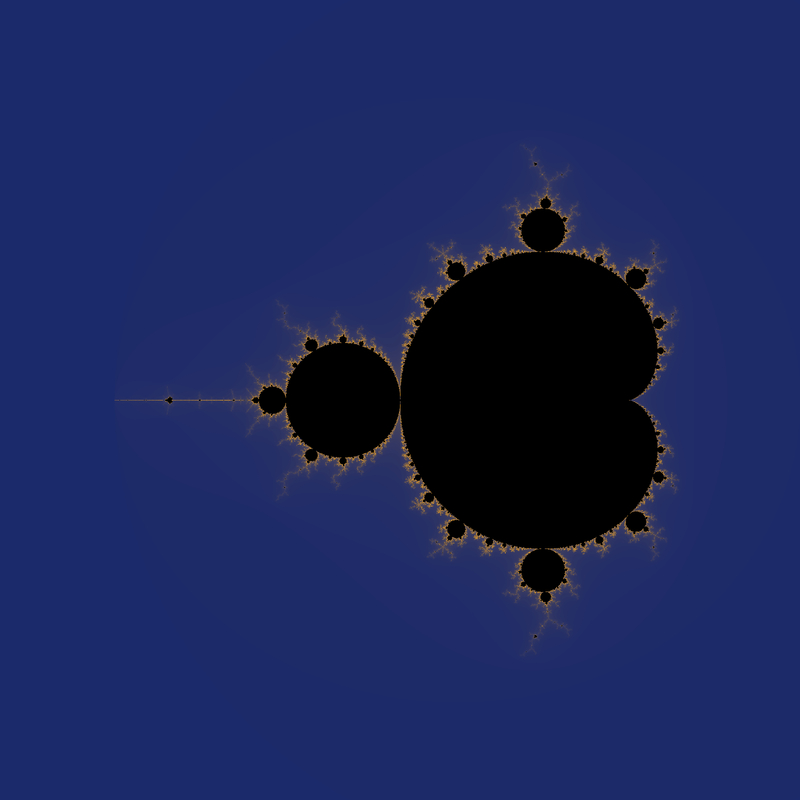
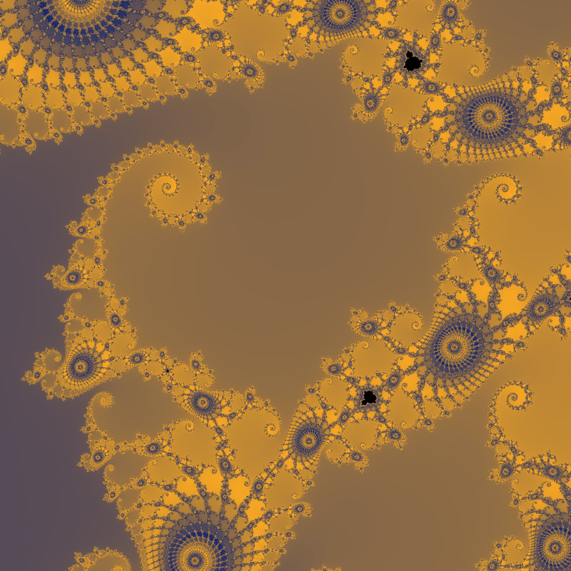

# Mandelbrot CLI

A small command-line Mandelbrot renderer written in C++ (CPU, with a CUDA variant available). It renders fractal images and writes them as binary `.ppm` files.

## Build

```bash
make
```

This builds:
- `./mandelbrot` (CPU)
- `./mandelbrot_gpu` (CUDA)

## Usage

```bash
./mandelbrot [options]
```

Common options:
- `--real_center`
- `--imaginary_center`
- `--viewport_width`
- `--viewport_height`
- `--image_width`
- `--iteration_count`
- `--palette_size`
- `--output_path`
- `--output_file`

Default output is `./mandelbrot.ppm`.

## Examples

1. Running `./mandelbrot` yields:



2. Running `/mandelbrot --real_center=-0.7488 --imaginary_center=0.1 --viewport_width=0.001 --viewport_height=0.001` yields:


